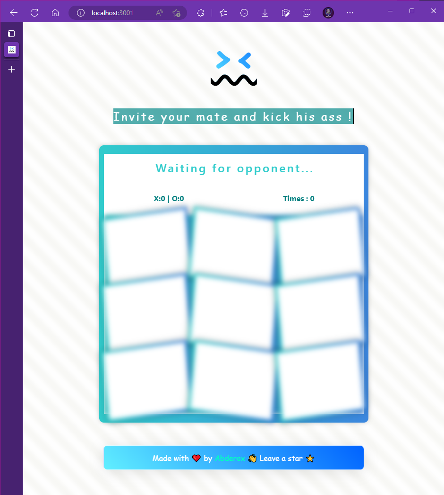

# XO Game with React and Styled Components by Abderox

    

This app is a simple, two-player XO game that is built using React and Styled Components. The goal of the game is to place three X or O symbols in a row, column, or diagonal, before your opponent. This app was created by Abderox as a personal project to refresh the mind and improve technical skills.

## Features

- Two-player game where each player takes turns placing X or O symbols on the game board.
- User-friendly interface with clear instructions and a visual representation of the game board.
- Styled Components (CSS-in-JS) for styling.

## Upcoming Features

- Multiplayer capability using socket.io.
- Improved styling and user interface.

## Installation

To run the app, follow these steps:

1. Clone the repository to your local machine.
2. Navigate to the root directory of the repository.
3. Run `npm install` to install all dependencies.
4. Run `npm start` to start the development server.
5. The app should now be running on `http://localhost:3000`.

## Demo

    

    

    

## Contributions

If you would like to contribute to the development of this app, please fork the repository and submit a pull request. Abderox is open to suggestions and improvements to make this project the best it can be.

